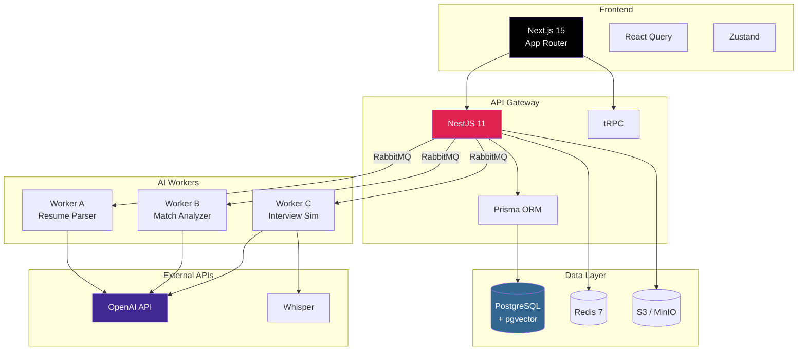
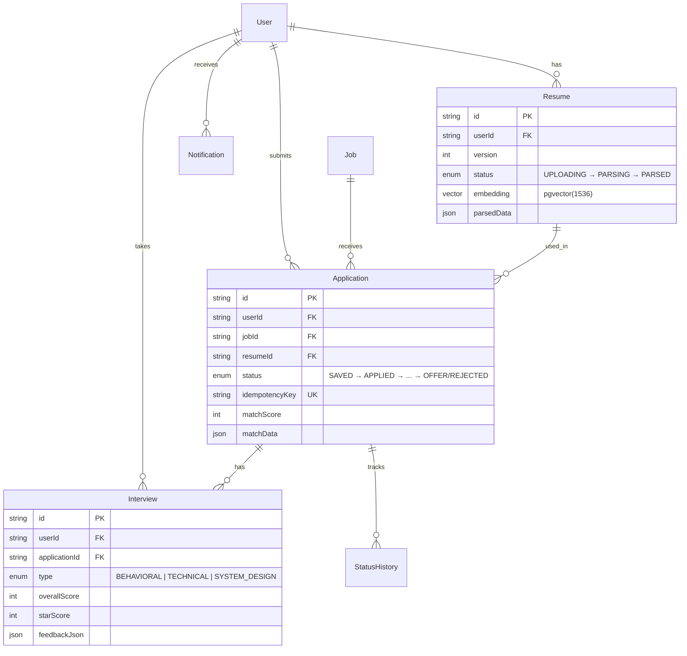

# Longkedin — 智能求职全链路工作台

> AI-Powered Job Search Full-Link Workbench
>
> **状态**: v0.1.0 — MVP 架构设计阶段 | [架构文档](./docs/ARCHITECTURE.md) | [开发指南](./docs/DEVELOPMENT.md)

---

## 解决什么问题？

留学生与初级工程师求职时面临的 4 大痛点：

| 痛点             | 现状                                          | Longkedin 方案                        |
| ---------------- | --------------------------------------------- | ------------------------------------- |
| **信息碎片化**   | 岗位散落 LinkedIn/Indeed/官网，Excel 手动追踪 | 多源聚合 + Kanban 看板 + 智能状态机   |
| **简历匹配低效** | 每次手动改关键词，不知差距在哪                | AI 向量匹配 + 缺失技能分析 + 自动建议 |
| **面试准备盲目** | 靠刷题网站，无个性化反馈                      | 语音面试舱 + STAR 框架评分 + 转写复盘 |
| **跟进复盘缺失** | Offer 对比靠感觉，错过最佳窗口                | 时间线管理 + 转化漏斗 + 拒信分析      |

**核心价值**：申请转化率提升，每周节省可节省大量时间投简历。

---

## 技术架构



### 技术栈

| 层级              | 选型                                                                 | 理由                          |
| ----------------- | -------------------------------------------------------------------- | ----------------------------- |
| **Frontend**      | React 19 + TypeScript + Next.js 15 (App Router) + Tailwind + Zustand | SSR/SSG/SEO + PWA 离线缓存    |
| **Backend**       | NestJS 11 + tRPC + Prisma + PostgreSQL                               | 端到端类型安全 + 企业级模块化 |
| **AI Workers**    | Python FastAPI + LangChain + Celery + RabbitMQ                       | Python AI 生态 + 异步解耦     |
| **Infra**         | Docker + Terraform + AWS (ECS Fargate / RDS / S3 / CloudFront)       | 容器化 + IaC + 蓝绿部署       |
| **Observability** | OpenTelemetry + Prometheus/Grafana + Sentry + ELK                    | 全链路 Trace + 告警           |
| **Security**      | NextAuth (OAuth2/OIDC) + JWT + RBAC + AES-256 + Rate Limiting        | 多租户 + GDPR/CCPA 合规       |

---

## 快速开始

```bash
# 1. 克隆项目
git clone <repo-url> && cd longkedin

# 2. 环境配置
cp .env.example .env
# 编辑 .env，至少填入 OPENAI_API_KEY

# 3. 安装依赖
pnpm install

# 4. 启动基础设施 (PostgreSQL, Redis, RabbitMQ, MinIO)
pnpm docker:dev

# 5. 初始化数据库
pnpm db:generate && pnpm db:push && pnpm db:seed

# 6. 启动所有服务
pnpm dev
```

| 服务               | URL                                       |
| ------------------ | ----------------------------------------- |
| Web 前端           | http://localhost:3000                     |
| tRPC Playground    | http://localhost:4000/api/trpc-playground |
| RabbitMQ Dashboard | http://localhost:15672                    |
| MinIO Console      | http://localhost:9001                     |
| Jaeger UI          | http://localhost:16686                    |

详细开发指南见 [DEVELOPMENT.md](./docs/DEVELOPMENT.md)

---

## 📁 项目结构

```
longkedin/
├── apps/
│   ├── web/                        # Next.js 15 前端
│   │   ├── src/
│   │   │   ├── app/                # App Router (Server Components)
│   │   │   │   ├── (auth)/         # 登录/注册
│   │   │   │   ├── (dashboard)/    # 后台功能
│   │   │   │   │   ├── jobs/       # 岗位聚合
│   │   │   │   │   ├── tracker/    # 申请看板 (Kanban)
│   │   │   │   │   ├── resume/     # AI 简历编辑器
│   │   │   │   │   ├── interview/  # 语音面试舱
│   │   │   │   │   └── analytics/  # 数据看板
│   │   │   │   └── api/trpc/       # tRPC endpoint
│   │   │   ├── components/         # shadcn/ui 组件
│   │   │   ├── features/           # 业务功能模块
│   │   │   ├── hooks/              # React Query + 自定义 hooks
│   │   │   ├── stores/             # Zustand 状态管理
│   │   │   └── lib/                # 工具函数 + tRPC client
│   │   ├── e2e/                    # Playwright E2E 测试
│   │   └── next.config.ts
│   ├── api/                        # NestJS 后端
│   │   ├── src/
│   │   │   ├── modules/            # auth, user, job, application, resume, interview...
│   │   │   ├── common/             # guards, interceptors, filters, pipes, middleware
│   │   │   ├── trpc/               # tRPC routers
│   │   │   ├── queue/              # RabbitMQ producers
│   │   │   └── config/             # 配置模块
│   │   └── prisma/
│   │       ├── schema.prisma       # 数据模型 (10+ models)
│   │       └── migrations/
│   └── workers/                    # Python AI Workers
│       ├── worker_resume/          # Worker A: 简历/JD 解析 + 向量嵌入
│       ├── worker_match/           # Worker B: 余弦相似度 + RAG + 技能差距分析
│       ├── worker_interview/       # Worker C: Whisper 转写 + AI 评分 + TTS
│       └── shared/                 # 共享 Python 库
├── packages/
│   ├── shared-types/               # 共享 TypeScript + Zod Schema
│   └── eslint-config/              # 共享 ESLint 配置
├── infra/
│   ├── docker/                     # Docker Compose (dev, prod)
│   └── terraform/                  # Terraform (AWS provisioning)
├── docs/
│   ├── ARCHITECTURE.md             # 架构设计文档 (ADR + 全景图 + 安全)
│   ├── DEVELOPMENT.md              # 开发指南 (环境搭建 + 规范 + FAQ)
│   ├── API.md                      # API 设计 (tRPC + REST + WebSocket + MQ)
│   └── DEPLOYMENT.md               # 部署指南 (CI/CD + AWS + 蓝绿部署)
└── .github/workflows/              # CI/CD Pipelines
    ├── ci.yml                      # Lint → Test → Build
    ├── deploy-staging.yml          # Deploy Staging + E2E
    └── deploy-prod.yml             # Blue/Green Production Deploy
```

---

## 📊 核心数据模型



完整 Schema 见 [apps/api/prisma/schema.prisma](./apps/api/prisma/schema.prisma)

---

## 🔒 生产级特性

- ✅ **幂等键** — `Idempotency-Key` 防重复提交，有效期 24h
- ✅ **分布式锁** — Redis Redlock 防并发状态冲突
- ✅ **审计日志** — 全量记录 `status_changed_at` + `changed_by`
- ✅ **软删除** — `deletedAt` 字段，数据可恢复
- ✅ **OpenTelemetry** — 自动注入 Trace ID，全链路追踪
- ✅ **API 限流** — Redis Sliding Window，100 req/min/user
- ✅ **敏感加密** — AES-256-GCM 应用层加密 (email/phone)
- ✅ **CSP + CORS** — 多层 Web 安全防护
- ✅ **降级策略** — AI API 超时 fallback 到缓存/规则引擎

---

## 🗺️ MVP 路线图

| Phase       | 内容                                       | 状态   |
| ----------- | ------------------------------------------ | ------ |
| **Phase 0** | 项目骨架搭建 (monorepo, lint, CI, Docker)  | 当前   |
| **Phase 1** | 用户认证 + 简历上传 + AI 解析 (Worker A)   | 未完成 |
| **Phase 2** | 岗位管理 + 申请状态机 + Kanban 看板        | 未完成 |
| **Phase 3** | AI 匹配分析 + Cover Letter 生成 (Worker B) | 未完成 |
| **Phase 4** | 语音面试舱 + AI 反馈 (Worker C)            | 未完成 |
| **Phase 5** | Analytics Dashboard + 邮件通知             | 未完成 |
| **Phase 6** | 性能优化 + 安全审计 + 生产部署             | 未完成 |

---

## 📖 文档索引

| 文档                                             | 内容                                          |
| ------------------------------------------------ | --------------------------------------------- |
| [ARCHITECTURE.md](./docs/ARCHITECTURE.md)        | 架构全景、ADR 决策、安全设计、可观测性        |
| [DEVELOPMENT.md](./docs/DEVELOPMENT.md)          | 环境搭建、代码规范、Git 工作流、FAQ           |
| [API.md](./docs/API.md)                          | tRPC 路由、REST 端点、WebSocket、MQ 协议      |
| [DEPLOYMENT.md](./docs/DEPLOYMENT.md)            | CI/CD Pipeline、Docker Compose、AWS Terraform |
| [schema.prisma](./apps/api/prisma/schema.prisma) | 完整数据模型 (10+ models, pgvector)           |

---

## 🤝 贡献指南

1. Fork 本仓库
2. 创建功能分支: `feat/LLK-XXX-description`
3. 遵循 [Conventional Commits](https://www.conventionalcommits.org/)
4. 确保 lint + test 通过
5. 提交 PR 到 `develop` 分支

---

## 📄 License

MIT © Longkedin Team
