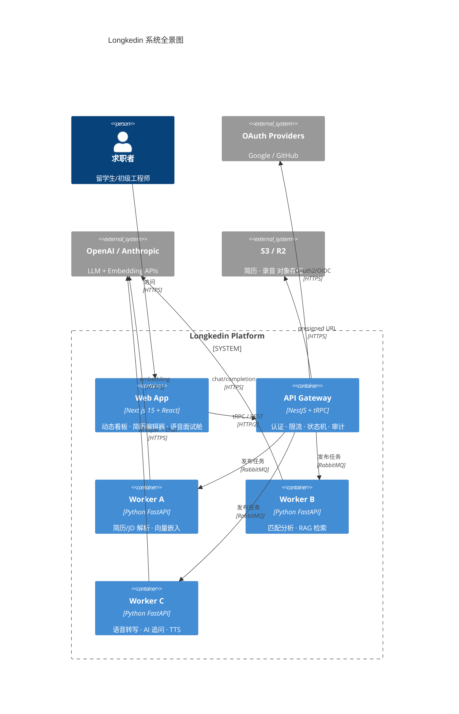
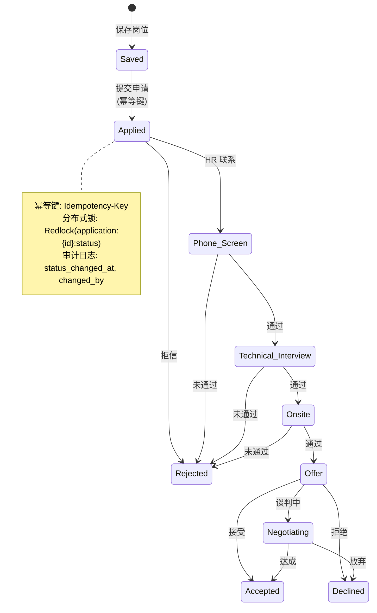
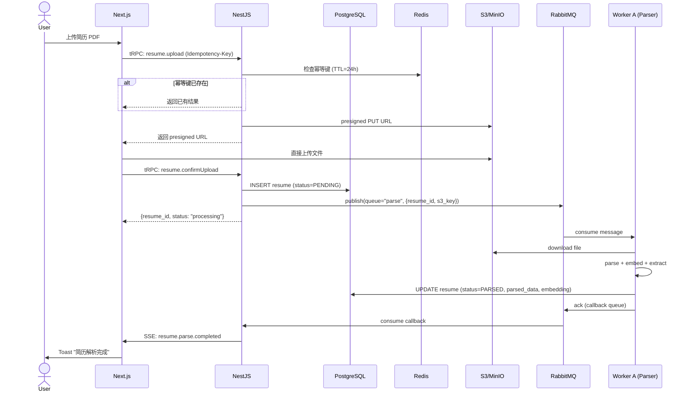

# Longkedin — 架构设计文档 (Architecture Design)

> 版本: v0.1.0 | 最后更新: 2026-06-01 | 作者: Longkedin Team

---

## 目录

1. [系统全景](#1-系统全景)
2. [架构决策记录 (ADR)](#2-架构决策记录)
3. [前端架构](#3-前端架构)
4. [后端架构](#4-后端架构)
5. [AI Worker 架构](#5-ai-worker-架构)
6. [数据流设计](#6-数据流设计)
7. [安全架构](#7-安全架构)
8. [可观测性](#8-可观测性)

---

## 1. 系统全景



### 运行时拓扑

| 组件 | 技术栈 | 端口 | 副本数 | 资源 |
|------|--------|------|--------|------|
| Web (SSR) | Next.js 15 | 3000 | 2~4 | 512Mi / 0.5 vCPU |
| API Gateway | NestJS 11 | 4000 | 2~4 | 1Gi / 1 vCPU |
| Worker A (Parser) | Python 3.12 + FastAPI | 8001 | 2 | 2Gi / 1 vCPU |
| Worker B (Match) | Python 3.12 + FastAPI | 8002 | 2 | 1Gi / 1 vCPU |
| Worker C (Interview) | Python 3.12 + FastAPI | 8003 | 1~2 | 4Gi / 2 vCPU (GPU opt) |
| PostgreSQL | 16 | 5432 | 1 (HA opt) | 4Gi / 2 vCPU |
| Redis | 7 | 6379 | 1 (Cluster opt) | 1Gi / 0.5 vCPU |
| RabbitMQ | 3.13 | 5672/15672 | 1 (Cluster opt) | 2Gi / 1 vCPU |
| MinIO (Dev) | Latest | 9000/9001 | 1 | 1Gi / 0.5 vCPU |

---

## 2. 架构决策记录 (ADR)

### ADR-001: 选择 tRPC 而非 REST/GraphQL

**状态**: ✅ 已采纳

**背景**: 前端 Next.js + 后端 NestJS 同属 TypeScript 生态。

**决策**: 使用 tRPC 作为主要 API 协议，对第三方集成保留 REST 端点。

**理由**:
- 端到端类型安全：从 Prisma Schema → tRPC Router → React Hook 全链路类型推导
- 零样板代码：无需手写 OpenAPI spec 或 GraphQL schema
- 开发效率：修改后端返回类型，前端编译时报错

**代价**: tRPC 仅支持 HTTP，不支持 WebSocket。语音面试实时通信需另建 WebSocket 通道。

### ADR-002: AI Worker 独立为 Python 服务而非嵌入 NestJS

**状态**: ✅ 已采纳

**决策**: AI 任务（解析、匹配、语音）由独立的 Python FastAPI 微服务处理，通过 RabbitMQ 异步通信。

**理由**:
- Python 是 AI/ML 生态的一等公民（LangChain、Whisper、HuggingFace 均为 Python-only 或 Python-first）
- 独立扩缩容：面试高峰期 Worker C 需要 GPU，Worker A/B 只需 CPU
- 故障隔离：AI API 限流/超时不会影响主 API 的认证和 CRUD 操作
- 独立部署：AI 模型更新不需要重新部署 NestJS

### ADR-003: PostgreSQL 为主数据库，不使用 MongoDB

**状态**: ✅ 已采纳

**决策**: 全量使用 PostgreSQL，包括 JSONB 存储非结构化数据。

**理由**:
- Prisma 对 PostgreSQL 支持最成熟
- 求职数据天然是关系型的（User → Application → Resume → Interview）
- JSONB 可存储 JD 原始数据、AI 分析结果等半结构化内容
- 单个 DB 降低运维复杂度，避免跨库 JOIN 的分布式事务

### ADR-004: 初期使用 Docker Compose，生产迁移到 ECS Fargate

**状态**: ✅ 已采纳

**决策**: 开发阶段 Docker Compose 一键启动全栈；生产环境通过 Terraform 部署到 AWS ECS Fargate (serverless containers)。

**理由**: 免去 K8s 学习曲线，Fargate 提供自动扩缩、零节点管理、按需付费。后期流量增长可平滑迁移到 EKS。

---

## 3. 前端架构

### 3.1 组件分层

```
┌─────────────────────────────────────────┐
│                  Pages                   │  ← App Router (Server Components by default)
├─────────────────────────────────────────┤
│              Features                    │  ← 业务功能模块 (KanbanBoard, ResumeEditor, InterviewRoom)
├─────────────────────────────────────────┤
│            UI Components                 │  ← shadcn/ui 原子组件 (Button, Dialog, Card)
├─────────────────────────────────────────┤
│          Hooks + Stores                  │  ← React Query (server state) + Zustand (client state)
├─────────────────────────────────────────┤
│         tRPC Client + NextAuth           │  ← 类型安全的 API 调用 + 认证
└─────────────────────────────────────────┘
```

### 3.2 状态管理策略

| 状态类型 | 工具 | 示例 |
|----------|------|------|
| Server State | TanStack React Query v5 | 岗位列表、申请数据、AI 分析结果 |
| Client UI State | Zustand | 看板拖拽状态、编辑器撤销栈、侧栏展开 |
| URL State | nuqs (URL query params) | 筛选器、分页、排序 |
| Form State | React Hook Form + Zod | 简历编辑表单、面试设置 |
| Auth State | NextAuth.js Session | 用户会话、角色权限 |

### 3.3 路由设计

```
/                          →  Landing Page (SSG, 营销)
/(auth)/
  /login                   →  登录页
  /register                →  注册页
/(dashboard)/
  /jobs                    →  岗位聚合页 (搜索 + 列表 + 详情)
  /tracker                 →  申请看板 (Kanban: Saved → Applied → Interview → Offer)
  /resume                  →  AI 简历编辑器
  /interview               →  模拟面试列表
  /interview/[id]          →  语音面试舱 (WebRTC 录音 + 实时转写)
  /analytics               →  个人数据看板 (转化率、弱项分析)
  /settings                →  设置 (Profile, OAuth, Billing)
/api/trpc/[trpc]           →  tRPC endpoint
```

---

## 4. 后端架构

### 4.1 NestJS 模块划分

```
apps/api/src/
├── modules/
│   ├── auth/              # 认证模块 (NextAuth + OAuth2/OIDC)
│   ├── user/              # 用户 CRUD + Profile
│   ├── job/               # 岗位聚合与管理
│   ├── application/       # 申请状态机 (核心)
│   ├── resume/            # 简历版本管理
│   ├── interview/         # 面试管理与调度
│   ├── notification/      # 通知路由 (Email/In-App/Push)
│   ├── analytics/         # 统计数据聚合
│   └── webhook/           # 外部回调 (邮件解析、OAuth 事件)
├── common/
│   ├── guards/            # AuthGuard, RoleGuard, ThrottlerGuard
│   ├── interceptors/      # TraceInterceptor, AuditInterceptor, CacheInterceptor
│   ├── filters/           # GlobalExceptionFilter, ValidationExceptionFilter
│   ├── pipes/             # ZodValidationPipe
│   ├── decorators/        # @CurrentUser, @IdempotencyKey, @Trace
│   └── middleware/        # RequestIdMiddleware, CorsMiddleware
├── prisma/
│   ├── schema.prisma      # 数据模型定义
│   └── migrations/        # 数据库迁移
├── trpc/
│   ├── trpc.module.ts     # tRPC 模块注册
│   ├── trpc.router.ts     # 根路由聚合
│   └── routers/           # 各模块 tRPC router
├── queue/
│   ├── queue.module.ts    # RabbitMQ 生产者封装
│   └── producers/         # AI 任务生产者 (parse-resume, match-jd, start-interview)
└── config/
    ├── app.config.ts      # 全局配置 (Zod schema 校验)
    ├── redis.config.ts    # Redis 连接 + Redlock 配置
    └── storage.config.ts  # S3/MinIO 客户端配置
```

### 4.2 Application State Machine



### 4.3 生产级中间件链

```
Request
  → RequestIdMiddleware (注入 X-Request-Id)
  → CorsMiddleware
  → HelmetMiddleware (CSP / XSS 防护)
  → RateLimitGuard (Redis Sliding Window, 100 req/min per user)
  → AuthGuard (JWT/OAuth2 验证)
  → RoleGuard (RBAC: user / admin)
  → ZodValidationPipe (请求体验证)
  → TraceInterceptor (OpenTelemetry Span)
  → AuditInterceptor (记录 changed_by + changed_at)
  → IdempotencyInterceptor (幂等键检查)
  → Controller / tRPC Procedure
  → CacheInterceptor (Redis 缓存，TTL 60s)
  → Response
```

---

## 5. AI Worker 架构

### 5.1 Worker 通信协议

```
NestJS API (Producer)          RabbitMQ              Python Worker (Consumer)
      │                          │                          │
      │ ──publish(queue="parse")──→                          │
      │                          │ ──deliver(msg)────────→  │
      │                          │                          │ Process PDF/DOCX
      │                          │                          │ Extract skills
      │                          │                          │ OpenAI embedding
      │                          │                          │
      │                          │ ←────ack(result)───────── │
      │ ←──consume(callback)─────│                          │
      │                          │                          │
      │ Update DB: resume.parsed │                          │
      │ Notify frontend (SSE)    │                          │
```

### 5.2 Worker A — Resume/JD Parser

```
输入: S3 presigned URL (PDF/DOCX) 或 原始文本
处理流程:
  1. PyPDF2 / python-docx 提取文本
  2. LangChain TextSplitter 分块 (chunk_size=1000, overlap=200)
  3. OpenAI text-embedding-3-small → 向量嵌入 (1536d)
  4. 实体提取: 技能、公司、职位、年限 (spaCy NER + GPT-4o mini)
  5. 写入 PostgreSQL (pgvector extension)
输出: { skills[], experiences[], education[], embedding }
降级: API 超时 → 回退到关键词正则匹配
```

### 5.3 Worker B — Match & Gap Analyzer

```
输入: resume_id + job_id
处理流程:
  1. 从 pgvector 检索 resume & JD 向量
  2. 余弦相似度计算 (overall + per-skill)
  3. RAG 检索: 从行业标准技能库检索匹配的技能要求
  4. GPT-4o 生成:
     - 匹配度评分 (0-100)
     - 缺失技能列表 (优先级排序)
     - 简历修改建议 (具体措辞)
     - 定制化 Cover Letter 草稿
输出: { score, missing_skills[], suggestions[], cover_letter }
降级: API 限流 → 仅返回向量相似度分数 + 规则匹配缺失项
```

### 5.4 Worker C — Interview Simulator

```
输入: user_id + interview_config (type, difficulty, focus_areas)
处理流程:
  1. 前端 WebRTC getUserMedia → 录音 → WebSocket 发送音频帧
  2. Worker 接收 → Whisper (本地或 API) 实时转写
  3. LLM 分析: STAR 框架匹配度、语速、填充词统计
  4. LLM 生成追问 (基于前一个回答的深度追问)
  5. 反馈文本返回前端 (可选的 ElevenLabs TTS → 语音)
输出 (实时 SSE):
  { transcript, star_score, pace, filler_words[], follow_up_question, feedback }
降级: Whisper API 不可用 → 提示用户手动输入回答文本
```

---

## 6. 数据流设计

### 6.1 简历解析完整链路



### 6.2 缓存策略

| 数据 | 缓存层 | TTL | 失效策略 |
|------|--------|-----|----------|
| 岗位列表 (搜索) | Redis | 5min | 分页参数变化时 bypass |
| AI 匹配结果 | Redis | 30min | 简历/JD 更新时主动失效 |
| 用户 Session | Redis | 7d | JWT 过期自然失效 |
| 限流计数器 | Redis | 1min sliding | 窗口滑动自动清理 |
| 面试转写缓存 | Redis | 1h | 面试结束时清理 |

---

## 7. 安全架构

### 7.1 认证与授权

- **OAuth2/OIDC**: NextAuth.js 集成 Google + GitHub OAuth
- **JWT**: Access Token (15min) + Refresh Token (7d)，HttpOnly Cookie
- **RBAC**: 角色分为 `user`、`premium`、`admin`
- **多租户隔离**: 所有查询通过 `WHERE user_id = current_user_id` (Prisma Middleware 自动注入)

### 7.2 数据保护

| 措施 | 实现 |
|------|------|
| 传输加密 | TLS 1.3 (CloudFront → ALB → ECS) |
| 静态加密 | AES-256-GCM (S3 SSE-KMS) |
| 敏感字段加密 | `resume.email`, `resume.phone` (应用层 AES-256 加密) |
| 密钥管理 | AWS Secrets Manager (生产) / .env (开发) |
| PII 脱敏 | 日志中自动脱敏 email/phone/SSN (Pino + redact) |

### 7.3 攻击防护

- **Rate Limiting**: Redis Sliding Window，每用户 100 req/min，每 IP 200 req/min
- **Idempotency-Key**: 防重复提交，键有效期 24h
- **CSP Headers**: `Content-Security-Policy` 限制脚本来源
- **CORS**: 白名单域名
- **SQL 注入**: Prisma 参数化查询（天然防护）
- **CSRF**: SameSite=Strict Cookie + CSRF Token

---

## 8. 可观测性

### 8.1 三大支柱

| 支柱 | 工具 | 关键指标 |
|------|------|----------|
| **Logging** | Pino → ELK (Elasticsearch + Logstash + Kibana) | 结构化 JSON 日志，含 trace_id + user_id |
| **Metrics** | Prometheus + Grafana | QPS、P95 Latency、Error Rate、队列积压率、缓存命中率 |
| **Tracing** | OpenTelemetry SDK → Jaeger / Grafana Tempo | 全链路 Trace (Web → API → MQ → Worker → DB) |

### 8.2 Grafana Dashboard 关键面板

```
┌─────────────────────────────────────────────────────┐
│ Row 1: 业务概览                                       │
│ [今日活跃用户] [新增申请] [AI任务完成数] [面试完成数]     │
├─────────────────────────────────────────────────────┤
│ Row 2: API 性能                                       │
│ [QPS (by endpoint)] [P50/P95/P99 Latency] [Error 4xx/5xx Rate] │
├─────────────────────────────────────────────────────┤
│ Row 3: AI Worker                                      │
│ [队列深度 (parse/match/interview)] [处理耗时] [API限流触发次数] │
├─────────────────────────────────────────────────────┤
│ Row 4: 基础设施                                        │
│ [DB Connections] [Redis Memory] [S3 Throughput] [CPU/Mem per Service] │
└─────────────────────────────────────────────────────┘
```

### 8.3 告警规则

| 告警 | 条件 | 严重级别 | 通知渠道 |
|------|------|----------|----------|
| API P95 > 2s | 持续 5min | Warning | Slack |
| API Error Rate > 5% | 持续 3min | Critical | PagerDuty |
| Worker 队列积压 > 100 | 持续 10min | Warning | Slack |
| DB Connection > 80% | 持续 5min | Critical | PagerDuty |
| OpenAI API 限流 | 任何触发 | Warning | Slack |
| 用户注册异常激增 | > 50/min | Info | Slack |

---

## 附录: 技术债务追踪

| ID | 描述 | 影响 | 计划版本 |
|----|------|------|----------|
| TD-001 | Worker C 语音面试目前仅支持英文，多语言待扩展 | 非英语用户无法使用 | v0.3.0 |
| TD-002 | 岗位爬虫需对接 LinkedIn/Indeed API（目前仅 CSV 导入） | 自动化程度有限 | v0.2.0 |
| TD-003 | Redis 单实例，需升级为 Cluster 支持 HA | 单点故障风险 | v0.2.0 |
| TD-004 | pgvector 索引尚未调优（IVFFlat → HNSW） | 大规模向量检索性能 | v0.3.0 |
