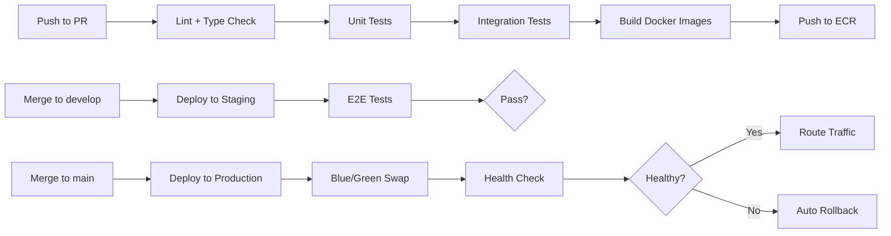

# Longkedin — 部署指南 (Deployment Guide)

> 本文档涵盖本地 Docker 开发环境与 AWS 生产部署。

---

## 目录

1. [CI/CD Pipeline](#1-cicd-pipeline)
2. [Docker Compose 本地部署](#2-docker-compose-本地部署)
3. [AWS 生产部署 (Terraform)](#3-aws-生产部署)
4. [蓝绿部署策略](#4-蓝绿部署策略)
5. [灾备与恢复](#5-灾备与恢复)

---

## 1. CI/CD Pipeline



### Pipeline 阶段说明

| 阶段 | 触发条件 | 耗时 | 工具 |
|------|----------|------|------|
| **Lint** | 所有 PR | ~30s | ESLint, Prettier, ruff |
| **Type Check** | 所有 PR | ~1min | tsc, pyright |
| **Unit Tests** | 所有 PR | ~2min | Vitest, pytest |
| **Integration Tests** | PR → develop/main | ~5min | Supertest + Testcontainers |
| **Build** | PR → develop/main | ~3min | Docker Buildx (多架构) |
| **Deploy Staging** | merge → develop | ~10min | Terraform apply (staging workspace) |
| **E2E Tests** | Deploy Staging 完成 | ~8min | Playwright |
| **Deploy Prod** | merge → main | ~10min | Terraform apply (prod), 蓝绿部署 |

---

## 2. Docker Compose 本地部署

### 2.1 服务拓扑

```yaml
# infra/docker/docker-compose.yml — 基础设施
services:
  postgres:       # PostgreSQL 16 + pgvector
  redis:          # Redis 7 (with persistence)
  rabbitmq:       # RabbitMQ 3.13 (with management plugin)
  minio:          # MinIO (S3-compatible local storage)
  jaeger:         # Jaeger (分布式追踪)

# infra/docker/docker-compose.dev.yml — 开发叠加
services:
  web:            # Next.js dev server (hot reload)
  api:            # NestJS dev server (hot reload)
  worker-resume:  # Worker A (hot reload via --reload)
  worker-match:   # Worker B
  worker-interview: # Worker C
```

### 2.2 启动命令

```bash
# 纯基础设施 (适合开发时手动启动应用)
docker compose -f infra/docker/docker-compose.yml up -d

# 全栈一键启动
docker compose -f infra/docker/docker-compose.yml -f infra/docker/docker-compose.dev.yml up -d

# 查看日志
docker compose -f infra/docker/docker-compose.yml logs -f api

# 销毁
docker compose -f infra/docker/docker-compose.yml -f infra/docker/docker-compose.dev.yml down -v
```

---

## 3. AWS 生产部署

### 3.1 资源清单

| 资源 | 用途 | 规格 |
|------|------|------|
| **ECS Fargate** | Web / API / Worker 运行环境 | 见架构文档运行时拓扑 |
| **RDS PostgreSQL** | 主数据库 (Multi-AZ) | db.t3.large, 100GB gp3 |
| **ElastiCache Redis** | 缓存/会话/限流 (Cluster Mode) | cache.t3.medium, 2 shards |
| **Amazon MQ** | RabbitMQ 托管 (或自建 EC2) | mq.t3.micro (单节点) |
| **S3** | 简历、录音、静态资源 | Standard (IA 归档规则) |
| **CloudFront** | CDN + WAF | 全球加速 + DDoS 防护 |
| **ALB** | 负载均衡 + HTTPS 终结 | 按需 |
| **ECR** | Docker 镜像仓库 | 按需 |
| **Secrets Manager** | 密钥管理 | 按需 |
| **SES** | 邮件发送 | 按需 |

### 3.2 月费估算 (MVP 阶段)

| 服务 | 月费 (USD) |
|------|-----------|
| ECS Fargate (4 services) | ~$120 |
| RDS (db.t3.large, Multi-AZ) | ~$180 |
| ElastiCache (cache.t3.medium) | ~$60 |
| Amazon MQ (mq.t3.micro) | ~$25 |
| S3 + CloudFront | ~$10 |
| OpenAI API | $50~$300 (用量相关) |
| **总计** | **~$450~$700** |

---

## 4. 蓝绿部署策略

```
                       ┌──────────┐
                       │   ALB    │
                       └────┬─────┘
                            │
              ┌─────────────┴─────────────┐
              │                           │
         ┌────▼────┐                ┌────▼────┐
         │  Blue   │  (Active)      │  Green  │  (Standby)
         │ ECS Svc │                │ ECS Svc │
         │ v1.2.0  │                │ v1.3.0  │
         └─────────┘                └─────────┘

1. 部署 Green (新版本) 到 ECS
2. 健康检查 Green (curl /api/rest/health/ready)
3. ALB Target Group 切换: Blue → Green
4. 观察 5 分钟 (错误率、延迟)
5. 如果异常 → ALB 切回 Blue (回滚)
6. 如果正常 → 下线 Blue，Green 成为新的 Blue
```

---

## 5. 灾备与恢复

### 5.1 备份策略

| 数据 | 备份频率 | 保留期 | 工具 |
|------|----------|--------|------|
| PostgreSQL | 每日自动 + 事务日志 (WAL) | 30 天 | RDS Automated Backup |
| Redis | RDB 快照 (每 6h) | 7 天 | ElastiCache Snapshot |
| S3 (简历/录音) | 跨区域复制 (CRR) | 永久 | S3 Replication |
| Terraform State | 每次 apply | 永久 | S3 + DynamoDB Lock |

### 5.2 RPO / RTO

| 场景 | RPO (数据丢失) | RTO (恢复时间) |
|------|---------------|---------------|
| 单实例故障 | 0 (Multi-AZ 自动切换) | < 2 分钟 |
| AZ 故障 | 0 | < 5 分钟 |
| 区域故障 | < 1 小时 | < 30 分钟 (Route53 DNS 切换) |
| 人为误删 | 取决于备份点 | < 1 小时 (RDS Point-in-Time Recovery) |
